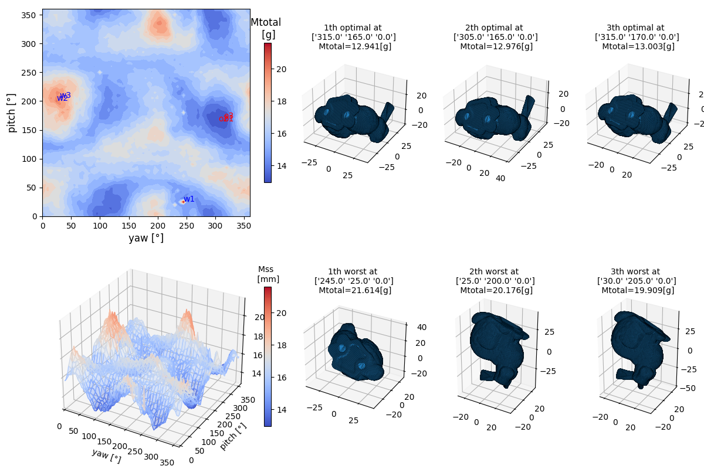
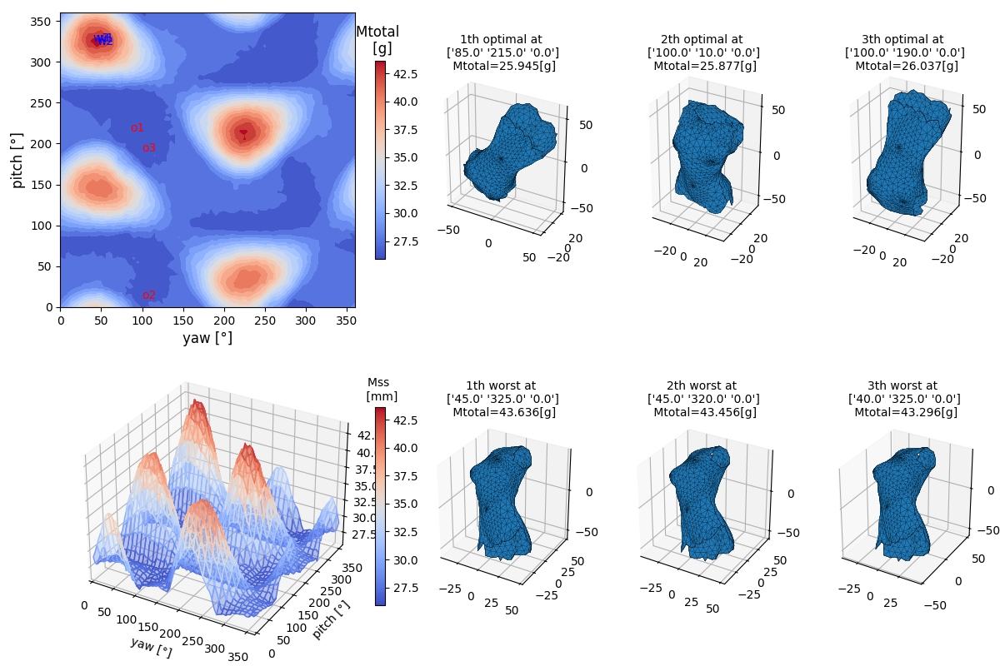
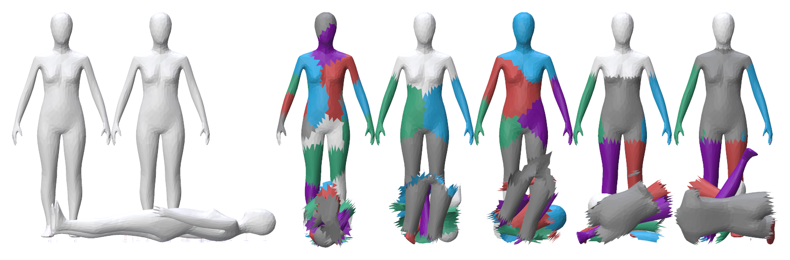
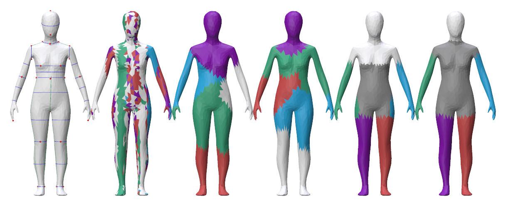

# Tomo_Shell2025 (확장 리포지토리)

> ⚠️ **이 리포지토리는 원본 GitHub 리포지토리( `cfms-lab/Tomo_Shell2025` )와 별개입니다.**
> 원본에 **새로운 연구(draft_sh2, draft_sh3)** 를 추가한 확장본입니다.

---

## 📌 가장 먼저 읽어 주세요 — 무엇이 "발표본"이고 무엇이 "신규"인가

| 구분 | 위치 | 성격 |
|------|------|------|
| **① 발표된 논문 (2025 한국섬유공학회지)** | 루트의 `TSE_TomoSh1.*`, `TSE_TomoSh2.*`, `TSE_TomoSh3.*` 및 `cfms_*` 라이브러리 | **이미 학회지에 발표·게재된 원본 코드/논문** |
| **② 이번에 새로 개발한 연구 (this work)** | **`draft_sh2/`**, **`draft_sh3/`** 폴더 | **아직 미발표. 이번 리포지토리에서 새로 개발한 신규 원고·코드·데이터** |
| **③ 신규 개발 코드 표시** | 소스코드 내 **`★ NEW (this work)`** 주석 | 발표본 파일 안에 추가/수정된 신규 부분은 이 주석으로 강조 |

즉,
- **루트의 `tomosh*.*` (= `TSE_TomoSh*.py/.pdf`) 는 2025년 섬유공학회지에 발표된 것**입니다.
- **`draft_sh2`, `draft_sh3` 는 이번에 새로 개발한 것**입니다.
- 발표본 스크립트(`TSE_TomoSh?.py`) 안에서 새로 손댄 부분은 **`★ NEW (this work)`** 주석으로 표시해 두었습니다.

---

## ① 발표된 논문 (루트, 2025 한국섬유공학회지)

설치(공통): Python 3.10/3.11/3.12 에서
```
pip install -r "requirements(python3.10).txt"
```

### I. solid mesh의 최적 배치

이 프로젝트는 얇은 쉘(shell) 메쉬뿐 아니라 **일반적인 닫힌(solid, watertight) 메쉬도 지원**합니다.
`TSE_TomoSh1.py`는 입력 메쉬의 watertight 여부로 `bShellMesh`를 자동 판정하므로(★ NEW),
solid 메쉬를 넣으면 별도 설정 없이 같은 파이프라인으로 최적 프린팅 배향을 탐색합니다.
아래는 Stanford Bunny(`MeshData/Bunny_69k.stl`, 약 69k 삼각형)의 예입니다
(재현: `.\pics\regen_pics.ps1 solid1`).



solid mesh 최적 배향(TomoNV) 관련 참고문헌:

1. Jin Young Jung, Seonkoo Chee and In Hwan Sul, "Automatic Segmentation and 3D Printing of A-shaped Manikins using a Bounding Box and Body-feature Points", *Fashion and Textiles*, 8(13), pp.1-21, (2021) <a href="https://dx.doi.org/10.1186/s40691-021-00255-8" target="_blank" rel="noopener">doi:10.1186/s40691-021-00255-8</a>
2. Jin Young Jung, Seonkoo Chee, and In Hwan Sul, "Support structure tomography using per-pixel signed shadow casting in human manikin 3D printing", *Fashion and Textiles*, (2022) <a href="https://dx.doi.org/10.1186/s40691-022-00290-z" target="_blank" rel="noopener">doi:10.1186/s40691-022-00290-z</a>
3. Jin Young Jung, Seonkoo Chee, and In Hwan Sul, "Prediction of optimal 3D printing orientation using vertically sparse voxelization and modified support structure tomography", *International Journal of Clothing Science and Technology*, 35(5), pp.799-832, (2023) <a href="https://dx.doi.org/10.1108/IJCST-04-2023-0041" target="_blank" rel="noopener">doi:10.1108/IJCST-04-2023-0041</a>
4. Jae Ryoung Kim and In Hwan Sul, "Fast Prediction of 3D Printing Optimal Orientation Using General-Purpose Graphic Card Unit Calculation", *3D Printing and Additive Manufacturing*, 13(1), pp.50-62, (2026) <a href="https://dx.doi.org/10.1089/3dp.2024.0165" target="_blank" rel="noopener">doi:10.1089/3dp.2024.0165</a>

### II. shell 메쉬의 최적 배치 및 분할

#### `TSE_TomoSh1.py` — 얇은 쉘 구조 마네킨 메쉬의 3D프린팅 필라멘트 소모량 예측
Filament Usage Prediction in 3D Printing of Thin-Shell-Structured Manikin Mesh
· [한국섬유공학회지 2025-10, TSE.2025.62.319](http://dx.doi.org/10.12772/TSE.2025.62.319)


#### `TSE_TomoSh2.py` — 뼈대 구조와 군집 분석을 이용한 인체 마네킨의 최적 3D프린팅
Optimal 3D Printing of Human Manikin Using Bone Structure and Cluster Analysis
· [한국섬유공학회지 2025-12, TSE.2025.62.337](http://dx.doi.org/10.12772/TSE.2025.62.337)


#### `TSE_TomoSh3.py` — 뼈대 구조와 군집 분석을 이용한 사용자 정의 삼차원 인체 계측
User-Defined Three-Dimensional Human Body Measurement Using Bone Structure and Cluster Analysis
· [한국섬유공학회지 2025, TSE.2025.62.346](http://dx.doi.org/10.12772/TSE.2025.62.346)


> 참고
> - `open3d` 는 Python 3.12까지 지원합니다(3.14에서 설치 실패 가능).
> - GPU(쉘) 버전: 원본은 NVIDIA 40xx에서 테스트되었고, 본 확장본에서 **CUDA 13.3 + RTX 50xx(Blackwell, sm_120)** 로 재빌드·검증하였습니다(아래 `cfms_tomo` 참고).

---

## ② 이번에 새로 개발한 연구 — `draft_sh2/`, `draft_sh3/` (미발표, this work)

두 폴더는 **위 `TSE_TomoSh3` 인체 계측 파이프라인을 개선**한 두 편의 **신규 원고(논문 초안)** 와 그 재현 코드·그림·표를 담고 있습니다. 각 폴더는 `xelatex` 로 컴파일되는 독립 원고입니다.

### `draft_sh2/` — 법선 연속성 기반 점-뼈대 거리 개선을 통한 삼차원 인체 메쉬 분할의 강건화
- **무엇:** 인체를 6부위로 나누는 점-뼈대 거리(point-to-bone) 군집의 **이진 법선 패널티**가 고해상도 메쉬에서 파편화를 일으켜 둘레선 검출이 실패하는 문제를, **연속(continuous) 법선 패널티**로 개선. 추가로 연결성 평활화·스킨 가중치 분할을 비교.
- **신규 코드:** `cfms_meshcut/cut_math.py`의 `point_to_bone_dist_v2`, `cfms_meshcut/cut_function.py`의 `cutType.bone_p2bdist2 / bone_p2bdist3 / bone_skinweight` (원본 `point_to_bone_dist`·`bone_p2bdist`는 **전후 비교용으로 보존**).
- **결과물:** `manuscript.tex/.pdf`, `references.bib`, `comparison_table.*`, `segmentation_quality.csv`, `figures/`, 재현 스크립트 `make_tables.py`, `make_screenshots.py`.

### `draft_sh3/` — 자동 실패 탐지를 통한 강건한 뼈대 기반 삼차원 인체 계측 (국문)
- **무엇:** 분할 실패 시 **허위 둘레선을 정상값처럼 보고**하거나 **임의 자세에서 크래시**하는 문제를 해결. 실패 격리(R1)·둘레선 유효성 검증(R2)·비다양체 허용 길이 측정(R4)을 도입.
- **신규 코드:** `cfms_bodym/robust.py`의 **`BodyMeasureRobust`** 클래스 (원본 `cfms_bodym/__init__.py`의 `BodyMeasure`는 **전후 비교용으로 보존**).
- **결과물:** `manuscript.tex/.pdf`(국문), `references.bib`, `reliability.csv`, `jump_stats.csv`, `figures/`, 재현 스크립트 `make_reliability.py`, `make_figures.py`, `make_jump_stats.py`.

#### 신규 연구 재현 방법
```bash
# (논문 컴파일)  draft_sh2 또는 draft_sh3 폴더에서
xelatex manuscript.tex && bibtex manuscript && xelatex manuscript.tex && xelatex manuscript.tex

# (표/그림 재현)  프로젝트 conda 환경에서, 각 draft 폴더의 스크립트 실행
python draft_sh2/make_tables.py
python draft_sh2/make_screenshots.py
python draft_sh3/make_reliability.py
python draft_sh3/make_figures.py
python draft_sh3/make_jump_stats.py
```

---

## ③ 발표본 스크립트 안의 "신규 개발 부분" 찾기

발표본 `TSE_TomoSh?.py` 안에서 이번에 추가/수정한 부분은 모두 **`★ NEW (this work)`** 주석으로 표시했습니다. 예:

- `TSE_TomoSh3.py` — **`USE_ROBUST` 스위치**: `True`로 두면 신규 강건 계측기(`BodyMeasureRobust` + 개선 분할 `bone_p2bdist2`)를, `False`로 두면 발표본 그대로(baseline)를 실행합니다. (전후 비교 가능)
- `TSE_TomoSh1.py` — PLA 밀도(측정값 0.001121로 정정)와 `bShellMesh` 자동 판정(watertight)에 `★ NEW (this work)` 주석.

> 라이브러리(`cfms_meshcut`, `cfms_bodym`)의 신규 항목도 동일하게 **함수/클래스 이름을 원본과 다르게**(`*_v2`, `BodyMeasureRobust`, `bone_p2bdist2/3`, `bone_skinweight`) 두어 원본을 훼손하지 않고 전후를 비교할 수 있게 하였습니다.

---

## 폴더 구조 요약
```
TSE_TomoSh1/2/3.py , .pdf   # ① 발표된 논문(2025 TSE) — 루트
cfms_tomo/ cfms_meshcut/ cfms_bodym/ highfestiva_gltfLoader/   # 라이브러리(발표본 + ★NEW 표시 신규)
draft_sh2/                  # ② 신규: 분할(점-뼈대 거리) 개선 원고
draft_sh3/                  # ② 신규: 강건 계측(실패 탐지) 원고(국문)
MeshData/                   # 입력 메쉬(.gltf/.ply 등)
```
