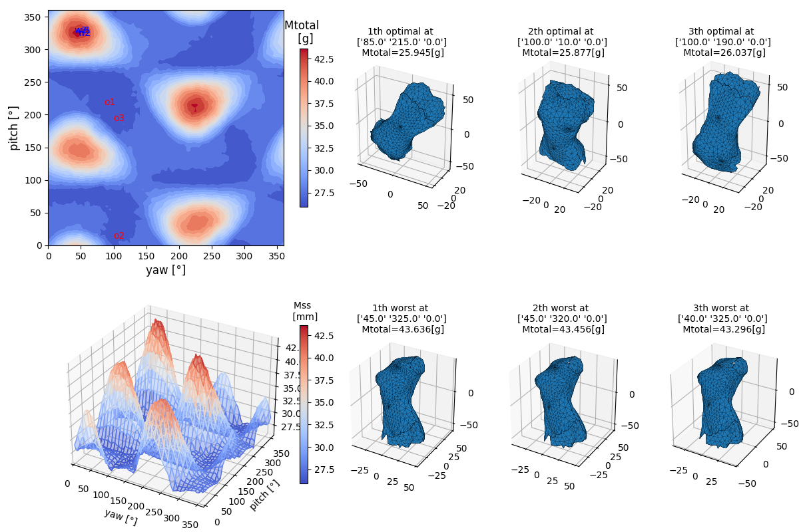
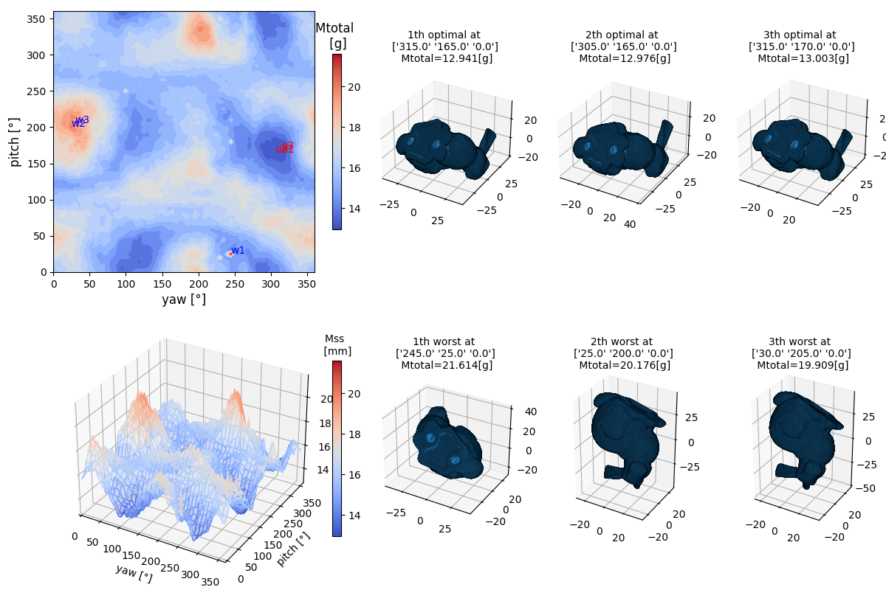
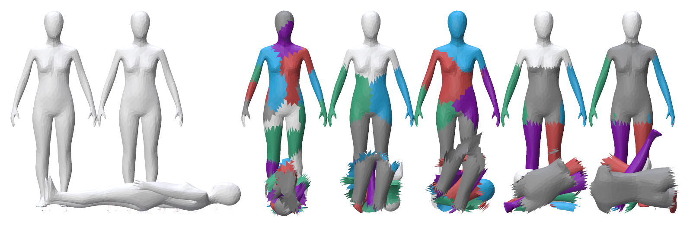
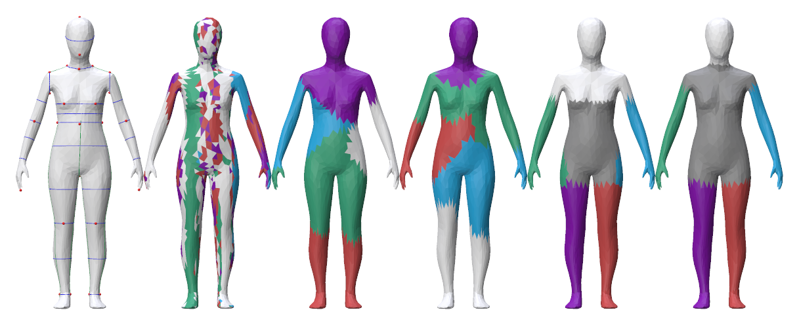

# Tomo_Shell2026

**3D 프린팅 지지구조 부피 예측 — solid & shell 메쉬, CPU/CUDA**
Support-structure volume prediction for 3D printing (solid & shell meshes, CPU/CUDA) — latest public release of the Tomo series.

얇은 쉘 구조의 인체 마네킨 메쉬와 일반적인 닫힌(solid) 메쉬에 대해 **3D 프린팅 최적 배향**과 **지지구조 부피·필라멘트 소모량**을 예측하는 "지지구조 단층촬영(support structure tomography)" 코드와, 이를 위한 **인체 메쉬 분할·계측** 코드를 담고 있습니다. 2025년 한국섬유공학회지에 발표한 세 편의 논문 코드가 그대로 들어 있고, 발표 이후 정정·개선한 부분은 소스 안에 `★ NEW` 주석으로 표시되어 있습니다.

> - 이 리포지토리는 `cfms-lab/Tomo_Shell2025`(원본)의 후속 **공개판**입니다. 개발은 별도의 비공개 리포지토리에서 진행하며, 이곳에는 검증된 스냅샷만 올립니다.
> - 논문 초안(미발표 원고) 폴더는 이 공개판에 **포함되어 있지 않습니다.** 관련 코드(`BodyMeasureRobust`, `bone_p2bdist2` 등)만 포함되며, 상세 내용은 논문 게재 후 공개합니다.

---

## 1. 빠른 시작 (Windows, 수업·실습용)

| 항목 | 요구 사항 |
|---|---|
| OS | Windows 10/11 x64 (C++ 계산 엔진이 `cfms_tomo/Tomo_Shell2026.dll` 로 미리 빌드되어 있음) |
| Python | **3.10 권장** (`.python-version` = 3.10.20). 3.11/3.12도 동작. 3.13 이상은 일부 패키지 설치 실패 가능 |
| GPU | 선택 사항. CUDA 모드는 NVIDIA GPU + CUDA 13.3 런타임 필요(RTX 50xx까지 검증). GPU가 없으면 CPU 모드로 동작 |

```powershell
# 1) 받기
git clone https://github.com/cfms-lab/Tomo_Shell2026.git
cd Tomo_Shell2026

# 2) 가상환경 만들기 (폴더 이름은 .venv 로 — pics/regen_pics.ps1 이 이 경로를 사용)
python -m venv .venv
.\.venv\Scripts\activate

# 3) 패키지 설치
pip install -r "requirements(python3.10).txt"

# 4) 첫 실행: 쉘 메쉬(바디스) 최적 배향 탐색
python TSE_TomoSh1.py
```

실행이 끝나면 3D 그래프(matplotlib) 창 또는 polyscope 뷰어가 열립니다. 창이 뜨지 않는 환경(원격, CI)에서는 `TOMO_NO_SHOW=1` 을 설정하고 `TOMO_PLOT3D_SAVE=파일명.png` 로 그림만 저장할 수 있습니다(아래 §4 참고).

---

## 2. 세 가지 예제 스크립트 (2025 한국섬유공학회지 발표 코드)

세 스크립트는 모두 **파일 상단의 변수로 입력 메쉬를 고르는 방식**입니다(주석 처리된 줄 중 하나를 살리면 됩니다). 명령행 인자는 받지 않습니다.

### `TSE_TomoSh1.py` — 얇은 쉘 구조 마네킨 메쉬의 3D프린팅 필라멘트 소모량 예측
Filament Usage Prediction in 3D Printing of Thin-Shell-Structured Manikin Mesh
· [한국섬유공학회지 2025-10, TSE.2025.62.319](http://dx.doi.org/10.12772/TSE.2025.62.319)

- 입력: `DataSet` 변수 (`MeshData/(1)sphere.ply` ~ `(7)bodice5.ply`). 환경변수 `TOMO_MESH_FILE` 로도 지정 가능.
- `theta_YP = 0` 이면 지정한 자세 하나만 계산, `theta_YP = 5` 이면 5° 간격으로 전체 자세를 탐색해 최적 배향을 찾습니다.
- 프린터 조건(벽 두께, 채움률, 임계각 60°, 래프트 등)은 `(2) specify 3D printer's g-code conditions` 블록에서 수정합니다.



**solid 메쉬도 그대로 지원합니다.** 입력 메쉬가 watertight(닫힌 면)인지 여부로 `bShellMesh` 를 자동 판정하므로(★ NEW), Stanford Bunny 같은 일반 메쉬를 넣으면 별도 설정 없이 같은 파이프라인이 돌아갑니다.

```powershell
$env:TOMO_MESH_FILE = 'MeshData/Bunny_69k.stl'   # 약 69k 삼각형
python TSE_TomoSh1.py
```



### `TSE_TomoSh2.py` — 뼈대 구조와 군집 분석을 이용한 인체 마네킨의 최적 3D프린팅
Optimal 3D Printing of Human Manikin Using Bone Structure and Cluster Analysis
· [한국섬유공학회지 2025-12, TSE.2025.62.337](http://dx.doi.org/10.12772/TSE.2025.62.337)

- 입력: `filename` 변수 (`MeshData/SK6th_*.gltf`, `masha1_*.gltf` — 뼈대(skeleton)가 포함된 glTF).
- CUDA 사용 여부: 환경변수 `TOMO_USE_CUDA=1` / `0` (기본값 CPU).
- 그 밖의 슬라이싱 옵션도 환경변수로 바꿀 수 있습니다: `TOMO_THETA_YP`(탐색 각도 간격, 기본 10°), `TOMO_SHELL_MESH`, `TOMO_SHELL_THICKNESS`, `TOMO_BED_TYPE`.
- 발표본과 동일한 코드입니다(★ NEW 없음).



### `TSE_TomoSh3.py` — 뼈대 구조와 군집 분석을 이용한 사용자 정의 삼차원 인체 계측
User-Defined Three-Dimensional Human Body Measurement Using Bone Structure and Cluster Analysis
· [한국섬유공학회지 2025, TSE.2025.62.346](http://dx.doi.org/10.12772/TSE.2025.62.346)

- 입력: `gltfLoader(filename=..., max_height=...)` — `max_height` 는 SizeKorea 키(mm).
- 환경변수 `TSE_SH3_USE_ROBUST` (기본 `1`): `1` 이면 개선된 강건 계측 파이프라인(`BodyMeasureRobust` + `bone_p2bdist2`), `0` 이면 발표본 그대로(baseline)를 실행합니다. 두 결과를 나란히 비교할 수 있습니다.



---

## 3. 발표본 대비 변경 사항 (`★ NEW` 표시)

발표본 코드는 원형을 유지하고, 새 항목은 **이름을 달리해서**(`*_v2`, `BodyMeasureRobust`, `bone_p2bdist2/3`, `bone_skinweight`) 추가했습니다. 소스에서 `★ NEW` 를 검색하면 모두 찾을 수 있습니다.

| 위치 | 변경 내용 |
|---|---|
| `TSE_TomoSh1.py` | PLA 밀도를 측정값 0.001121 g/mm³ 로 정정(논문 Table 1의 0.0121은 오타). `bShellMesh` 를 watertight 여부로 자동 판정 |
| `cfms_meshcut/cut_math.py`, `cut_function.py` | 점-뼈대 거리 분할의 연속 법선 패널티 `point_to_bone_dist_v2`, `cutType.bone_p2bdist2 / bone_p2bdist3 / bone_skinweight` (고해상도 메쉬에서 둘레선 검출이 깨지는 문제 개선) |
| `cfms_bodym/robust.py` | `BodyMeasureRobust`: 분할 실패 격리, 허위 둘레선 기각, 비다양체 허용 길이 측정 |
| `cfms_tomo/Tomo_Shell2026.dll`, `Tomo_Shell_vc_src/` | CUDA 13.3 + RTX 50xx(sm_120)로 재빌드. int16 오버플로로 지지구조 부피가 음수·축소되던 문제 수정(`BUGREPORT_2026-07-03_INT16_vss_overflow.md`), CUDA 슬롯 삽입 경합·비결정성 수정(`TODO_CUDA_issues_2026-07-04.md`). 정확성 수정 후 속도 회귀는 `PERF_REGRESSION_2026-07-05_correctness_fix.md` 참고 |

> 주의: 2026-07-03 이전 DLL로 계산한 지지구조 부피 값은 int16 래핑으로 오염되어 있었습니다. 논문 수치를 재현하려면 현재 DLL로 다시 계산하세요.

---

## 4. 그림 재생성과 환경변수

`pics/` 의 네 그림은 프로젝트 루트에서 다음으로 다시 만들 수 있습니다(`.venv\Scripts\python.exe` 사용).

```powershell
.\pics\regen_pics.ps1          # 네 장 모두
.\pics\regen_pics.ps1 sh2      # sh1 | sh2 | sh3 | solid1 중 하나
```

| 환경변수 | 뜻 |
|---|---|
| `TOMO_NO_SHOW=1` | 창을 띄우지 않음(headless) |
| `TOMO_MESH_FILE` | `TSE_TomoSh1.py` 입력 메쉬 교체 |
| `TOMO_PLOT3D_SAVE`, `TOMO_PLOT3D_DPI` | `TSE_TomoSh1.py` 3D 그래프를 PNG로 저장 |
| `TOMO_SCREENSHOT`, `TOMO_SCREENSHOT_W/H`, `TOMO_CAMERA_*`, `TOMO_GROUND_PLANE`, `TOMO_SSAA` | polyscope 화면 캡처와 카메라(값 설명: `pics/camera_settings.md`) |
| `TOMO_USE_CUDA`, `TOMO_THETA_YP`, `TOMO_SHELL_MESH`, `TOMO_SHELL_THICKNESS`, `TOMO_BED_TYPE` | `TSE_TomoSh2.py` 슬라이싱 옵션(CUDA 사용, 탐색 각도 간격, 쉘 모드·두께, 바닥구조) |
| `TSE_SH3_USE_ROBUST` | `TSE_TomoSh3.py` 강건 파이프라인 / baseline 전환 |

---

## 5. 폴더 구조

```
TSE_TomoSh1.py / .pdf        # 쉘·solid 메쉬 최적 배향, 필라멘트 소모량 (논문 1)
TSE_TomoSh2.py / .pdf        # 뼈대·군집 분석 기반 마네킨 최적 프린팅 (논문 2)
TSE_TomoSh3.py / .pdf        # 뼈대 기반 사용자 정의 인체 계측 (논문 3)
cfms_tomo/                   # 지지구조 단층촬영 엔진: Python 래퍼 + Tomo_Shell2026.dll
  Tomo_Shell_vc_src/         #   C++/CUDA 소스 (Visual Studio 솔루션, cpu_src, cuda_src)
  shell_test/                #   쉘 모드 테스트·검증 스크립트
cfms_meshcut/                # 메쉬 분할 (k-means, k-medoids, 뼈대 거리 등)
cfms_bodym/                  # 인체 계측 (BodyMeasure, BodyMeasureRobust)
highfestiva_gltfLoader/      # glTF(뼈대 포함) 로더
MeshData/                    # 예제 메쉬: 구·반구·마네킨·바디스(.ply), SizeKorea 아바타(.gltf), Bunny_69k.stl
pics/                        # README 그림과 재생성 스크립트
requirements(python3.10).txt # pip 설치 목록 (권장)
requirements.txt, conda.yaml, pyproject.toml, uv.lock   # 대안 환경 정의
BUGREPORT_*.md, TODO_*.md, PERF_*.md                    # DLL 수정 이력(정확성·성능)
```

---

## 6. 참고문헌

지지구조 단층촬영(TomoNV)과 마네킨 3D 프린팅 관련 선행 연구:

1. Jin Young Jung, Seonkoo Chee and In Hwan Sul, "Automatic Segmentation and 3D Printing of A-shaped Manikins using a Bounding Box and Body-feature Points", *Fashion and Textiles*, 8(13), pp.1-21, (2021) <a href="https://dx.doi.org/10.1186/s40691-021-00255-8" target="_blank" rel="noopener">doi:10.1186/s40691-021-00255-8</a>
2. Jin Young Jung, Seonkoo Chee, and In Hwan Sul, "Support structure tomography using per-pixel signed shadow casting in human manikin 3D printing", *Fashion and Textiles*, (2022) <a href="https://dx.doi.org/10.1186/s40691-022-00290-z" target="_blank" rel="noopener">doi:10.1186/s40691-022-00290-z</a>
3. Jin Young Jung, Seonkoo Chee, and In Hwan Sul, "Prediction of optimal 3D printing orientation using vertically sparse voxelization and modified support structure tomography", *International Journal of Clothing Science and Technology*, 35(5), pp.799-832, (2023) <a href="https://dx.doi.org/10.1108/IJCST-04-2023-0041" target="_blank" rel="noopener">doi:10.1108/IJCST-04-2023-0041</a>
4. Jae Ryoung Kim and In Hwan Sul, "Fast Prediction of 3D Printing Optimal Orientation Using General-Purpose Graphic Card Unit Calculation", *3D Printing and Additive Manufacturing*, 13(1), pp.50-62, (2026) <a href="https://dx.doi.org/10.1089/3dp.2024.0165" target="_blank" rel="noopener">doi:10.1089/3dp.2024.0165</a>

이 리포지토리의 코드를 사용하실 때는 위 §2의 해당 논문(TSE.2025.62.319 / .337 / .346)을 인용해 주세요.

---

## 7. 관련 리포지토리와 라이선스

- `cfms-lab/Tomo_Shell2025` — 이 코드의 원본(2025 발표 당시 버전)
- `cfms-lab/tomoNV` — solid 메쉬용 지지구조 단층촬영(초기 버전)
- 라이선스: **GPL-3.0** (루트 `LICENSE`). C++/CUDA 엔진 소스(`cfms_tomo/Tomo_Shell_vc_src/LICENSE`)도 동일합니다.

문의: 설인환, 국립금오공과대학교 소재디자인공학과
